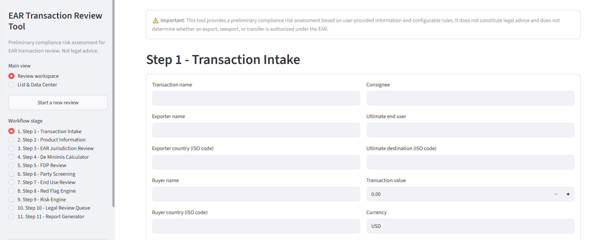
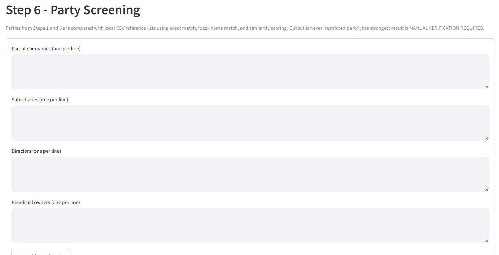
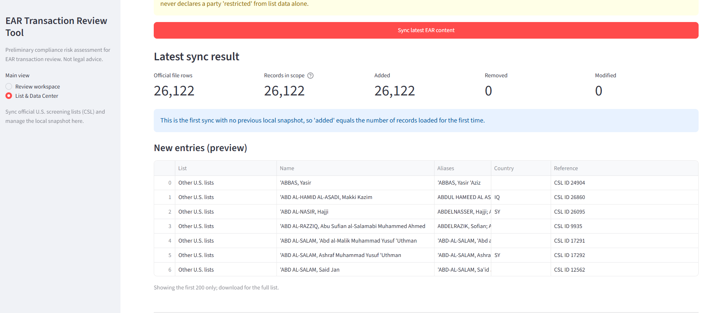
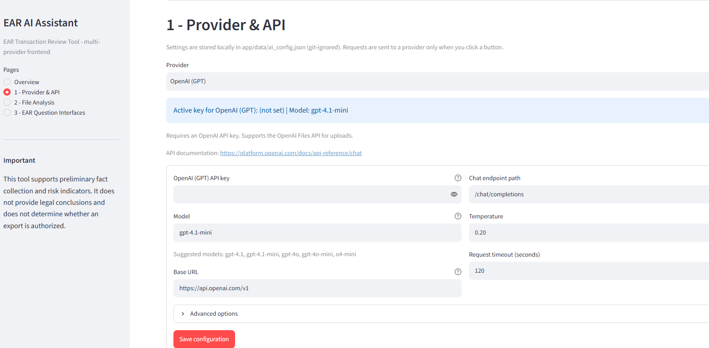

# EAR Transaction Review Tool

[English](README.md) | [中文](README.zh.md)


EAR Transaction Review Tool is a **local-first web application** that helps lawyers and export-compliance professionals perform an **initial** review of transactions that may be subject to the U.S. Export Administration Regulations (EAR).

> **Legal design principle:** This tool **never** produces definitive legal conclusions such as *"this transaction is legal"*, *"no license is required"*, or *"this transaction violates the EAR"*. It collects transaction facts, identifies missing information, applies configurable rules, calculates preliminary risk scores, flags issues for manual legal review, and generates a structured review report.

## Screenshots

| Review workbench | Party screening |
| --- | --- |
|  |  |

| List & Data Center | AI assistant |
| --- | --- |
|  |  |

---

## Requirements

- Python 3.10+
- Streamlit
- SQLite (built into Python)
- Pydantic v2
- ReportLab (PDF generation)
- Requests (LLM provider calls)
- pandas / openpyxl / xlrd (spreadsheet analysis)
- pytest (development / tests)

All Python dependencies are declared in [requirements.txt](requirements.txt). The application uses **no external paid APIs**. The list-sync feature (below) makes one outbound HTTPS request to the official U.S. government CSV file only when you click its button.

---

## Quick start

### 0. Easiest way: double-click a launcher

**Windows** - double-click one of these files in the project folder:

- `install-dependencies.bat` - run once to create `.venv` and install packages
- `start-windows.bat` - opens the review workbench at http://localhost:8501
- `start-ai-frontend.bat` - opens the AI assistant at http://localhost:8502
- `start-all.bat` - starts both tools at once

The older Chinese-named launchers (`启动-*.bat`) are still present and simply
forward to the English scripts above.

**macOS / Linux** - run the shell installers once, then start a tool:

```bash
chmod +x *.sh *.command     # required once after cloning on macOS/Linux
./install-dependencies.sh
./start.sh                  # review workbench, http://localhost:8501
./start-ai-frontend.sh      # AI assistant,     http://localhost:8502
```

On macOS you can also double-click `start.command` (or
`start-ai-frontend.command`) in Finder. If macOS blocks the first launch, run
`chmod +x start.command` in Terminal once, or start it with `bash start.command`.

Each launcher starts a local web server and opens your default browser. Keep
the console window open while you use the tool; closing it stops the server.

> **Highlights of this build:** the interface is fully English, the AI frontend
> supports GPT / Claude / DeepSeek / GLM / Qwen / Moonshot / Ollama / custom
> OpenAI-compatible gateways, and the sidebar's **List & Data Center** view has
> a **"Sync latest EAR content"** button (see
> [Synchronizing official EAR lists](#synchronizing-official-ear-lists)).

### 1. Create and activate a virtual environment

**Windows (PowerShell):**

```powershell
cd ear_transaction_review_tool
py -3 -m venv .venv
.\.venv\Scripts\Activate.ps1
```

**macOS / Linux:**

```bash
cd ear_transaction_review_tool
python3 -m venv .venv
source .venv/bin/activate
```

### 2. Install dependencies

```bash
pip install --upgrade pip
pip install -r requirements.txt
```

### 3. Run the application

```bash
streamlit run app/main.py
```

Open the local URL Streamlit prints (normally http://localhost:8501).

### 3b. Run the multi-provider AI assistant frontend

```bash
streamlit run app/ai_main.py
```

The English-language AI frontend provides:

1. **Provider & API configuration** - pick a provider, paste an API key, type
   any model identifier, and optionally override the base URL, chat path, or
   upload endpoint. Keys and per-provider model choices are stored locally in
   `app/data/ai_config.json` (git-ignored) and are never written into the repo.
2. **File analysis** - upload supporting documents (TXT, Markdown, CSV, JSON,
   PDF, DOCX, XLSX, HTML, XML, LOG). Text is always extracted locally; when the
   provider exposes an OpenAI-style Files API the original file is also
   uploaded. Both paths feed the chat request that summarizes EAR-relevant
   facts, missing information, and follow-up questions.
3. **Independent EAR question interfaces** - every question the reviewer
   should ask is a standalone interface defined in
   `app/rules/ear_question_interfaces.json`. Each interface has a stable ID,
   mapped EAR facts, English prompts (optional Chinese fields are retained for
   localized deployments), and its own "ask this question" action so questions
   can be invoked one at a time and answered into a review draft that can be
   downloaded as JSON.

#### Supported providers

| Provider | API style | Default endpoint | Notes |
| --- | --- | --- | --- |
| OpenAI (GPT) | OpenAI-compatible | `https://api.openai.com/v1` | Files API supported |
| Anthropic (Claude) | Anthropic Messages | `https://api.anthropic.com/v1` | `x-api-key` + `anthropic-version` |
| DeepSeek | OpenAI-compatible | `https://api.deepseek.com/v1` | Text extraction for files |
| Zhipu GLM | OpenAI-compatible | `https://open.bigmodel.cn/api/paas/v4` | Text extraction for files |
| Qwen (DashScope) | OpenAI-compatible | `https://dashscope.aliyuncs.com/compatible-mode/v1` | Text extraction for files |
| Moonshot (Kimi) | OpenAI-compatible | `https://api.moonshot.cn/v1` | Text extraction for files |
| Ollama (local) | OpenAI-compatible | `http://localhost:11434/v1` | No API key required |
| Custom | OpenAI-compatible | user supplied | Any gateway or corporate proxy |

Provider names and model lists are suggestions only - the model field accepts
any identifier, and the base URL / chat path can be overridden for gateways and
proxies. To add another vendor permanently, extend
`app/ai_frontend/providers.py`.

The AI frontend sends data to a third-party service **only when you click a
button**, and its system prompts enforce the same legal-design guardrail as
the core tool: it never concludes whether a transaction is legal, whether a
license is required, or whether the EAR is violated.

> Privacy note: AI requests transmit the API key, extracted file text, and the
> review summary you enter to the provider you configured. Only upload data you
> are authorized to share.

### 4. Run the tests

```bash
pytest
```

### 5. Generate the sample review report

```bash
python examples/sample_transaction.py
```

Output files are written to `reports/sample_report.html` and `reports/sample_report.pdf`. The sample exercises:

- a Chinese exporter (`CN`)
- a Singapore buyer (`SG`)
- a foreign-produced electronic product
- possible U.S.-origin software in the production chain
- incomplete ultimate end-user information

---

## Synchronizing official EAR lists

The **名录中心 / List & Data Center** view (switch to it from the sidebar)
adds a **"同步最近 EAR 内容"** button. Clicking it downloads the official U.S.
**Consolidated Screening List (CSL)** CSV published by the International Trade
Administration at:

- `https://data.trade.gov/downloadable_consolidated_screening_list/v1/consolidated.csv`
- Human-readable page: https://www.trade.gov/consolidated-screening-list

The CSL is refreshed daily and contains the BIS **Entity List (EL)**,
**Denied Persons List (DPL)**, **Unverified List (UVL)** and **Military End
User (MEU) List**, plus State/Treasury lists if you choose "all CSL lists".

The button **never modifies anything by itself**. It:

1. downloads the latest official file;
2. compares it with your previous local snapshot and shows **新增 / 移除 /
   变更** counts and previews;
3. lets you download the update log or the full new list as CSV;
4. applies the snapshot to `app/data/ear_synced_lists.csv` **only after you
   tick the confirmation box and click the apply button**.

After applying, Step 6 party screening automatically screens against the
synchronized snapshot in addition to the bundled example list. A running
update log is stored at `app/data/ear_sync_updates.csv` and metadata at
`app/data/ear_sync_meta.json`.

> **Important:** the lists are downloaded from official U.S. websites for
> reference screening only. A name match never establishes that a party is
> restricted; always verify identities against the Federal Register and the
> source agencies' official pages. This is also why the tool still reports
> `MANUAL VERIFICATION REQUIRED` at most.

No API key is required. If your organization requires a proxy or mirror,
set the `EAR_CSL_URL` environment variable or edit `url` in
`app/rules/ear_sync_sources.json`.

---

## The 11-step workflow

| Step | Module | What it does |
| --- | --- | --- |
| 1 | `models/transaction.py`, `main.py` | Transaction intake (parties, value, dates, destination). |
| 2 | `models/product.py`, `main.py` | Product information and existing classification. |
| 3 | `services/jurisdiction_service.py` | Conservative jurisdiction review state (POSSIBLE / REVIEW REQUIRED / INSUFFICIENT). |
| 4 | `services/deminimis_service.py` | Ratio of controlled U.S.-origin content to total foreign-product value. |
| 5 | `services/fdp_service.py` | Production dependency map and FDP flag. |
| 6 | `services/screening_service.py` | Local CSV party screening with exact/fuzzy match and similarity scoring. |
|   | `services/ear_list_sync_service.py` | "Sync latest EAR content" - download and diff the official CSL into local CSV files. |
| 7 | `services/enduse_service.py` | End-use flags (insufficient information, inconsistency, military indicators, unclear location). |
| 8 | `services/redflag_service.py` | JSON-configured red flag rules. |
| 9 | `services/risk_service.py` | JSON-configured category scoring (0-100) with per-point explanations. |
| 10 | `services/risk_service.py` + `rules/review_queue_rules.json` | Review queue routing. |
| 11 | `services/report_service.py` | HTML report and downloadable PDF with all 11 required sections. |

---

## Project structure

```
ear_transaction_review_tool/
│
├── app/
│   ├── main.py                  # Review workbench UI (streamlit run app/main.py)
│   ├── ai_main.py               # Multi-provider AI assistant (streamlit run app/ai_main.py)
│   ├── db.py                    # Local SQLite review history
│   ├── paths.py                 # Launch-directory-independent paths
│   ├── rule_evaluator.py        # Safe evaluator for JSON rule conditions
│   │
│   ├── ai_frontend/
│   │   ├── providers.py         # Provider registry (GPT/Claude/DeepSeek/GLM/Qwen/...)
│   │   ├── config_store.py      # Local per-provider config (JSON, legacy migration)
│   │   ├── llm_client.py        # OpenAI-compatible + Anthropic chat/file client
│   │   ├── deepseek_client.py   # Backwards-compatible alias for llm_client
│   │   ├── file_utils.py        # Local text extraction for uploaded files
│   │   └── question_registry.py # EAR question interface registry
│   │
│   ├── models/
│   │   ├── transaction.py       # Step 1 intake model
│   │   ├── product.py           # Step 2 product model
│   │   ├── party.py             # Step 6 screening models
│   │   └── review.py            # Result models across all services
│   │
│   ├── services/
│   │   ├── ear_list_sync_service.py
│   │   ├── jurisdiction_service.py
│   │   ├── deminimis_service.py
│   │   ├── fdp_service.py
│   │   ├── screening_service.py
│   │   ├── enduse_service.py
│   │   ├── redflag_service.py
│   │   ├── risk_service.py
│   │   └── report_service.py
│   │
│   ├── rules/
│   │   ├── ear_sync_sources.json            # Official CSL URL used by the sync button
│   │   ├── red_flag_rules.json
│   │   ├── risk_rules.json
│   │   ├── review_queue_rules.json
│   │   └── ear_question_interfaces.json  # EAR question interfaces (AI frontend)
│   │
│   ├── data/
│   │   ├── restricted_parties.csv    # SAMPLE reference list - replace before production use
│   │   ├── ear_synced_lists.csv      # created by the sync button (applied snapshot)
│   │   ├── ear_sync_updates.csv      # created by the sync button (append-only update log)
│   │   ├── ear_sync_meta.json        # last sync metadata
│   │   └── country_data.json
│   │
│   └── templates/
│       └── report.html
│
├── examples/
│   └── sample_transaction.py
│
├── tests/
│   ├── conftest.py
│   ├── test_condition_evaluator.py
│   ├── test_jurisdiction_service.py
│   ├── test_deminimis_service.py
│   ├── test_fdp_service.py
│   ├── test_screening_service.py
│   ├── test_enduse_service.py
│   ├── test_redflag_service.py
│   ├── test_risk_service.py
│   ├── test_sample_transaction.py
│   ├── test_ear_list_sync_service.py
│   ├── test_ai_frontend.py
│   ├── test_db.py
│   └── test_models.py
│
├── start-windows.bat            # Windows launchers (English primary names)
├── start-ai-frontend.bat
├── start-all.bat
├── install-dependencies.bat
├── start.sh                     # macOS / Linux launchers
├── start-ai-frontend.sh
├── start.command                # macOS double-click helpers
├── start-ai-frontend.command
├── install-dependencies.sh
├── requirements.txt
├── pytest.ini
└── README.md
```

---

## Configuration (JSON rules, no Python changes)

### Red flag rules - `app/rules/red_flag_rules.json`

Each rule has:

```json
{
  "rule_id": "RF001",
  "name": "Unknown Ultimate End User",
  "condition": "ultimate_end_user == null",
  "risk_points": 15,
  "action": "ENHANCED_DUE_DILIGENCE",
  "explanation": "The ultimate end user was not identified. Verify the end user before proceeding."
}
```

### Risk rules - `app/rules/risk_rules.json`

Defines each category's maximum, the 0-100 risk bands, and per-category rule lists. Example:

```json
{
  "rule_id": "EUS-03",
  "name": "Ultimate end user not identified",
  "condition": "ultimate_end_user == null or strip(str(ultimate_end_user)) == ''",
  "points": 12,
  "explanation": "The ultimate end user has not been identified, so end-user risk cannot be assessed."
}
```

The engine caps each category at its configured maximum and awards **every point through a rule**, so the report can explain the total.

### Review queue rules - `app/rules/review_queue_rules.json`

An ordered list of routing rules. The first matching rule decides the queue:

- `AUTO_REVIEW_COMPLETE`
- `COMPLIANCE_REVIEW_REQUIRED`
- `LEGAL_REVIEW_REQUIRED`
- `EXTERNAL_COUNSEL_REVIEW_RECOMMENDED`

### Destination data - `app/data/country_data.json`

Contains `US_EMBARGO` and `SPECIAL_ATTENTION` destination groups plus per-country notes. Risk rules read derived booleans such as `destination_embargoed` and `destination_special_attention`.

### Party screening list - `app/data/restricted_parties.csv`

The shipped file is **sample data only** and is clearly labeled as such. In production, replace it with a current official reference list (columns: `name, aliases, country, reference, source, notes`; comment lines beginning with `#` are ignored). You can also upload an additional CSV in Step 6 of the UI.

Instead of maintaining CSV files by hand, use the **名录中心** sync button to
download the official BIS lists. The synchronized file uses the same
`name, aliases, country, reference, source, notes` columns, so it can also be
exported and uploaded anywhere the screening CSV format is accepted.

---

## Rule expression language

JSON conditions are evaluated by `app/rule_evaluator.py` with a whitelisted, safe evaluator. Available elements:

- Fields: all normalized fact names (see `assemble_review_context` in `risk_service.py`), e.g. `ultimate_end_user`, `destination_embargoed`, `de_minimis_ratio`, `risk_level`.
- Comparisons: `==`, `!=`, `<`, `<=`, `>`, `>=`, `in`
- Boolean operators: `and`, `or`, `not`
- Literals: numbers, quoted strings, `true`, `false`, `null`
- Helpers: `str()`, `int()`, `float()`, `num()`, `len()`, `lower()`, `upper()`, `strip()`, `title()`, `contains(a, b)`, `startswith()`, `endswith()`, `isin(item, collection)`, `coalesce(*values)`

Examples:

```text
ultimate_end_user == null
destination_embargoed == true and risk_level == 'HIGH'
contains(product_description, 'military') or contains(product_description, 'defense')
de_minimis_computed == true and de_minimis_ratio >= 0.10
```

Unknown fields, attribute access, indexing, and arbitrary function calls raise a configuration error rather than executing arbitrary Python.

---

## Data persistence

Review history is stored locally in SQLite at `ear_reviews.db` in the project root (override with the `EAR_REVIEW_DB` environment variable). History is managed from the sidebar.

---

## How the application enforces the legal design principle

1. **Fact collection is separate from rule calculation.** Every step stores facts; no rule mutates user input.
2. **Jurisdiction output is limited** to `POSSIBLE EAR JURISDICTION`, `JURISDICTION REVIEW REQUIRED`, and `INSUFFICIENT INFORMATION`.
3. **Screening never outputs "RESTRICTED PARTY"** - even an exact name match produces `MANUAL VERIFICATION REQUIRED`.
4. **De minimis** reports the ratio plus a warning that the applicable legal threshold requires legal review.
5. **Risk scores are explicitly preliminary** and each point is explained.
6. **Every report contains the disclaimer:**

> This tool provides a preliminary compliance risk assessment based on user-provided information and configurable rules. It does not constitute legal advice and does not determine whether an export, reexport, or transfer is authorized under the EAR.

---

## Testing

Tests cover every engine: condition evaluator, jurisdiction, de minimis, FDP, screening, end use, red flags, risk scoring, review queue, models, SQLite persistence, and the complete sample transaction. Run:

```bash
pytest
```

## Troubleshooting

**`streamlit` is not recognized** - activate the virtual environment first, then `pip install -r requirements.txt`.

**Port 8501 is busy** - set another port, for example `PORT=8503 ./start.sh` or `streamlit run app/main.py --server.port 8503`.

**PDF does not display Chinese characters** - ReportLab's CID font `STSong-Light` is registered in `report_service.py`; confirm the PDF viewer supports standard Chinese CID fonts.

**macOS refuses to open `start.command`** - run `chmod +x start.command start-ai-frontend.command start.sh start-ai-frontend.sh install-dependencies.sh` once in Terminal, then double-click again. You can always fall back to `bash start.command`.

**An AI provider returns HTTP 401/403** - the key is missing, expired, or not authorized for the selected model. Re-save it under *1 - Provider & API* and use *Test chat endpoint*.

**A provider returns "model not found"** - the model list in the dropdown is only a suggestion. Type the exact model identifier from the provider's documentation.

**The list sync button fails on a corporate network** - the tool needs HTTPS access to `data.trade.gov`. Configure your system proxy, or point `EAR_CSL_URL` (environment variable) or the `url` in `app/rules/ear_sync_sources.json` at an approved mirror.

---

## Cloning and contributing

```bash
git clone https://github.com/ClaudiusKokoro/USA-EAR-transaction-review-tool.git
cd USA-EAR-transaction-review-tool

python -m venv .venv
source .venv/bin/activate        # Windows: .venv\Scripts\activate
pip install -r requirements.txt

pytest
streamlit run app/main.py
```

See [CONTRIBUTING.md](CONTRIBUTING.md) for the full development guide,
[SECURITY.md](SECURITY.md) for private vulnerability reporting, and
[CHANGELOG.md](CHANGELOG.md) for release history.

Before opening a pull request, please make sure that:

- `pytest` passes locally;
- no API keys, synchronized list files, SQLite databases, or report output are
  committed (`app/data/ai_config.json`, `app/data/ear_synced_lists.csv`,
  `app/data/ear_sync_updates.csv`, `app/data/ear_sync_meta.json`, `*.db` and
  `reports/` are all git-ignored);
- rule changes stay in `app/rules/*.json` where possible, so they remain easy
  for others to review and reuse.

---

## Disclaimer

This tool provides a preliminary compliance risk assessment based on user-provided
information and configurable rules. **It does not constitute legal advice and does
not determine whether an export, reexport, or transfer is authorized under the
EAR.** Screening results are reference data only - always verify parties against
the Federal Register and the official agency lists before relying on them.

---

## License

Released under the [MIT License](LICENSE).
